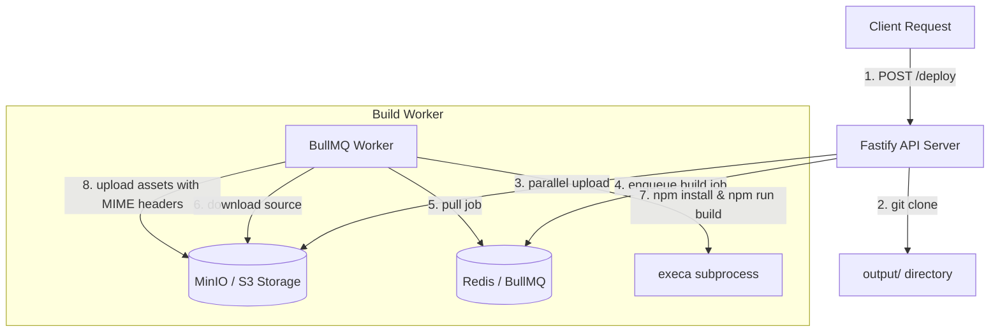

# Custom Vercel Clone

A lightweight, queue-based, self-hosted frontend deployment platform and build server. It clones git repositories, automates dependency installation and build pipelines, uploads compiled assets to S3/MinIO, and correctly maps MIME types for browser execution.

## 🚀 Features

* **Auto-Cloning:** Instantly clones public or local Git repositories dynamically.
* **Smart Build Pipeline:** Automatically detects Node.js projects (by searching for `package.json`). Runs build scripts (`npm install` & `npm run build`) and extracts output files.
* **Static Site Fallback:** Safely deploys repositories without any build requirements (plain HTML/CSS/JS) by bypassing compilation scripts.
* **Queue-Backed Processing:** Employs BullMQ and Redis to execute builds asynchronously, assuring single-job guarantees per deployment.
* **High-Speed Transfer:** Parallelizes S3/MinIO object uploads and downloads with configurable concurrency pooling.
* **Browser MIME-Type Mapping:** Programmatically maps file extensions (`.html`, `.css`, `.js`, etc.) to standard Content-Type headers, ensuring assets execute rather than download in client browsers.
* **Automated Cleanup:** Automatically purges temporary checkout files and output directories on boot and job completion to prevent disk leaks.

---

## 🛠️ Tech Stack

* **Runtime & Language:** TypeScript / Node.js
* **API Framework:** Fastify
* **Queue & Message Broker:** BullMQ & Redis
* **Object Storage:** S3 API (MinIO Client)
* **Process Execution:** Execa (Build automation)
* **Infrastructure Containerization:** Docker Compose

---

## 🏗️ System Architecture



---

## 💻 Setup & Installation

### 1. Prerequisites
Ensure you have the following installed on your machine:
* [Node.js](https://nodejs.org/) (v18+)
* [Docker & Docker Compose](https://www.docker.com/)
* [Git](https://git-scm.com/)

### 2. Start Services (Redis & MinIO)
Spin up the backing databases and storage engines using Docker Compose:
```bash
docker-compose up -d
```
* MinIO Console: `http://localhost:9001` (User: `minioadmin` / Password: `minioadmin`)
* Redis Port: `6379`

### 3. Install Dependencies
Install Node modules:
```bash
npm install
```

### 4. Run the API Server
Start the Fastify API server on port `3000`:
```bash
npm run dev
```
*The server will automatically verify and create the target `vercel` S3 bucket if it's missing on boot.*

### 5. Run the Build Worker
In a separate terminal, launch the BullMQ background worker to handle incoming compiles:
```bash
npm run worker
```

---

## 📖 API Usage

### Trigger a Deployment
Submit a Git repository URL (either remote HTTPS or absolute local path) to the `/deploy` endpoint:

```bash
curl -X POST http://localhost:3000/deploy \
  -H "Content-Type: application/json" \
  -d '{"repoUrl": "https://github.com/username/my-static-project.git"}'
```

#### Response (201 Created):
```json
{
  "message": "Repository received",
  "repoUrl": "https://github.com/username/my-static-project.git",
  "id": "eQIpqe0y"
}
```

* The source code is uploaded to MinIO under `<id>/...`.
* The build worker downloads the source and runs the build.
* Compiled artifacts are uploaded to MinIO under `builds/<id>/...` with correct Content-Type MIME headers.
