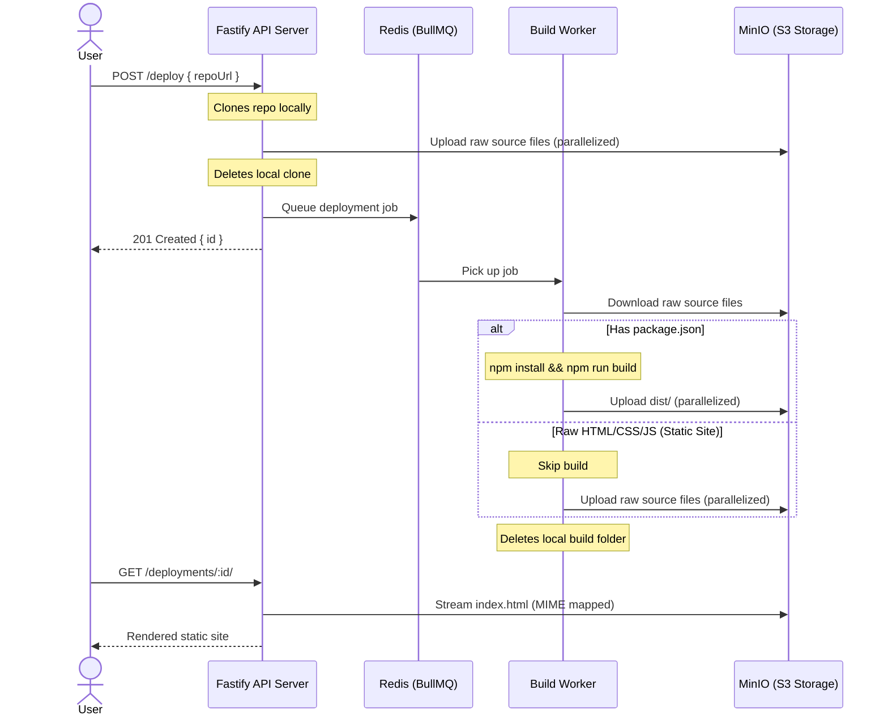

# 🚀 Mini-Vercel: Self-Hosted Frontend Deployment Engine

Ever wondered what platforms like Vercel or Netlify actually do under the hood when you push code? I did. So, I built a lightweight, self-hosted clone to figure out the plumbing. 

This is a queue-based frontend build server and hosting platform. You give it a Git URL, and it automatically clones the repo, determines if it needs a build, compiles it (if necessary), ships it to S3-compatible storage, and serves it back to the web with correct content-types and routing.

---

## 🏗️ How it Works under the Hood

Here's the birds-eye view of how a deployment moves through the system:



---

## 🛠️ The Tech Stack

*   **API Layer:** [Fastify](https://fastify.dev/) (extremely fast, low-overhead Node.js framework).
*   **Background Jobs:** [BullMQ](https://bullmq.io/) backed by **Redis** for robust, asynchronous task queueing.
*   **Build Engine:** Node's process execution via [Execa](https://github.com/sindresorhus/execa) to run sandboxed compile commands.
*   **Object Storage:** [MinIO](https://min.io/) (an S3-compatible local object store to hold raw source files and compiled build artifacts).
*   **Developer Experience:** TypeScript and [tsx](https://github.com/privatenumber/tsx) for fast, compile-free development execution.

---

## 🚀 Key Features

*   **📦 Smart Build Detection:** It automatically scans the repository on clone. If it finds a `package.json`, it runs a standard `npm install` and `npm run build` flow. If not, it treats it as a pure static site (vanilla HTML/CSS/JS) and bypasses compilation completely.
*   **⚡ Concurrency-Limited Transfers:** S3 uploads and downloads are parallelized up to a configurable threshold (default: 5 concurrent files) using a custom promise-race pool. This prevents network congestion and file-handle starvation.
*   **🧼 Auto-Cleanup (No Disk Bloat):** The API server and build workers immediately purge their working directory checkouts (`output/` and `tmp/`) upon finishing uploads/builds (or even if a job fails). Additionally, any leftover stale files are swept away automatically on system boot.
*   **📁 Proper Browser Execution (MIME-Type Mapping):** The app maps file extensions (`.html`, `.js`, `.css`, `.svg`, `.png`, etc.) to standard `Content-Type` headers when fetching assets from MinIO. Your browser will execute code and show images directly instead of prompting download popups.
*   **🔒 Simple Path Traversal Defense:** Includes guardrails that verify requested URLs do not contain directory traversal attempts (e.g. `..`), keeping other deployments private.

---

## 💻 Quick Start & Setup

Make sure you have **Node.js (v18+)**, **Git**, and **Docker** installed.

### 1. Spin up Redis and MinIO
We run our backing databases and storage in Docker Compose. Bring them up in the background:
```bash
docker compose up -d
```
*   **Redis** will bind to `localhost:6379`.
*   **MinIO Console** is available at [http://localhost:9001](http://localhost:9001) (Credentials: `minioadmin` / `minioadmin`).

### 2. Install Project Dependencies
```bash
npm install
```

### 3. Run the API Server
Start the Fastify HTTP gateway:
```bash
npm run dev
```
*The server boots on port `3000` and automatically runs a check to ensure the target `vercel` S3 bucket exists (creating it if it doesn't).*

### 4. Run the Build Worker
In a new terminal tab, start the BullMQ worker that processes tasks off the queue:
```bash
npm run worker
```

---

## 📖 API & Usage Guide

### Triggering a Deploy
Send a `POST` request to `/deploy` with the public Git repository URL you want to deploy. It also accepts absolute paths to local git repositories if you want to test local folders!

```bash
curl -X POST http://localhost:3000/deploy \
  -H "Content-Type: application/json" \
  -d '{"repoUrl": "https://github.com/octocat/Spoon-Knife.git"}'
```

#### Response:
```json
{
  "message": "Repository received",
  "repoUrl": "https://github.com/octocat/Spoon-Knife.git",
  "id": "uR8x9mZa"
}
```

Behind the scenes:
1. The API server clones the repository.
2. It pushes the raw code to MinIO under `uR8x9mZa/...`.
3. It pushes a job to Redis and returns the ID immediately.
4. The background worker picks up the job, builds the app, and writes the output files back to MinIO under `builds/uR8x9mZa/...`.

### Viewing Your Deploy
Simply navigate to:
```
http://localhost:3000/deployments/uR8x9mZa/
```
The server will look for `index.html` inside your deployment build directory and stream it straight to your browser.

---

## 💡 Notes & Lessons Learned

*   **Rate Limiting:** `/deploy` is rate-limited out-of-the-box (5 deploy requests per minute) to protect the server from getting overwhelmed by rogue scripts.
*   **Why queues matter:** By separation of concerns (API Server vs Build Worker), if the build worker crashes due to bad code or memory constraints, the API server remains completely unaffected and active.
*   **Storage layout:** We segment raw source code separately from build outputs (raw goes into `<id>/` while compiled files go into `builds/<id>/`). This ensures our worker starts with clean sources, while browser clients only ever see the final product.

---

*Disclaimer: This is a learning experiment. Please do not run production pipelines on this or use it to host sensitive projects — it lacks isolated build environments (containers/sandboxing), authentication, and custom domain routing!*
